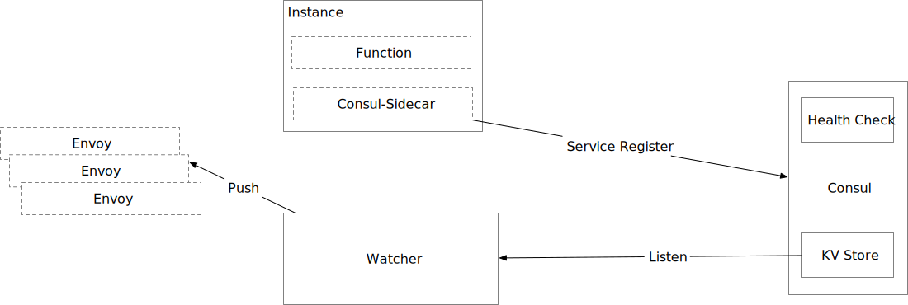

# Consul Service
>监听Consul service register 和 Consul KV. 当Endpoint发生变更时，实时同步到Envoy

 

## 流程图

### 组件描述

- SideCar
> 作为服务的Sidecar，当服务启动后，将服务数据注册到Consul中

- Watcher
> 监控Consul KV变化，生成Envoy数据并推送给Envoy

   + 启动参数
      - DEBUG
      - CONSUL_ADDRESS
      - MY_GRPC_PORT
      - TIO_CONSUL_CLUSTER_HTTP (默认Http Cluster地址)
      - TIO_CONSUL_CLUSTER_GRPC (默认Grpc Cluster地址)
      - TIO_CONSUL_CLUSTER_TCP (默认Tcp Cluster地址)