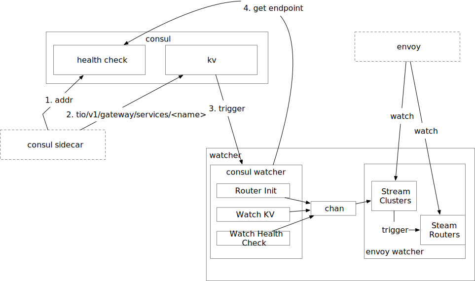

# Consul Service
>监听Consul service register 和 Consul KV. 当Endpoint发生变更时，实时同步到Envoy

 

## 流程图

### 组件描述

- SideCar
> 作为服务的Sidecar，当服务启动后，将服务数据注册到Consul中

- Watcher
> 监控Consul KV变化，生成Envoy数据并推送给Envoy

   + 启动参数
      - DEBUG
      - CONSUL_ADDRESS
      - MY_GRPC_PORT
      - TIO_CONSUL_CLUSTER_HTTP (默认Http Cluster地址)
      - TIO_CONSUL_CLUSTER_GRPC (默认Grpc Cluster地址)
      - TIO_CONSUL_CLUSTER_TCP (默认Tcp Cluster地址)

#### 细节

+ Watcher

`Sidecar`在启动时会将自身服务数据注册到`Consul`中(先注册实例数据Health Check,然后注册KV数据(服务属性))。 `Watcher`会通过监听`Health Check`和`KV`接受到这两个事件。

而后通过读取`KV`中的服务属性数据获取到服务元数据，而后在判断其`Health Check`是否成功，若实例健康检查成功，则生成最新的服务路由数据(包括cluster和router)，并通过chan通知`envoy watcher`。

`envoy watcher`分别通过`StreamCluster`和`StreamRouter`分别将生成的路由数据下发到`Envoy`实例中，从而完成服务注册，服务发现和服务路由.